# Examples

Every effect and preset, as a script you can run.

```bash
npm run examples                    # render all 37
node examples/effects/halftone.ts   # or just one
```

Every example is TypeScript and runs as-is — Node 26 strips types natively, and ts-node
or tsx work too. No build step, nothing to compile first.

Each script reads a source from `sources/`, applies one effect, and writes a
before/after pair into `svgs/`:

```ts
import { stouch, halftone } from '../../src/index.ts'
import { load, save } from '../support.ts'

const source = load('scene.svg')

const output = stouch(source, [halftone({ size: 5, angle: 15 })])

save('halftone', source, output)
```

In your own project that first import is `from 'stouch'`; here it points at the source
so the examples run against your working copy without a build.

## Layout

| Path | Contents |
| ---- | -------- |
| `sources/` | The four input drawings: `scene.svg` (full-bleed art), `mark.svg` (shapes on transparency), `tones.svg` (a full tonal range) and `motion.svg` (already animated) |
| `effects/` | One script per effect |
| `presets/` | One script per preset |
| `animated/` | Effects applied to an SVG that already animates |
| `svgs/` | Output — `<name>.before.svg` and `<name>.after.svg` for every example |
| `support.ts` | `load` and `save` helpers, so each example stays about the effect |

Each example runs against the source that shows it best:

- `mark.svg` for effects that reshape edges or cast light — `glow`, `shadow`, `outline`,
  `emboss`, `pixelate`, `wave`, `fade`, `neon` — because they need transparency around
  the artwork to have somewhere to go.
- `tones.svg` for effects that remap tone — `threshold`, `duotone`, `halftone`, `xerox`,
  `newsprint` — because a white-to-black ramp and a shaded sphere show the mapping.
- `scene.svg` for everything else.

### Effects

| Example | Before | After |
| ------- | ------ | ----- |
| [`blur`](effects/blur.ts) |  | 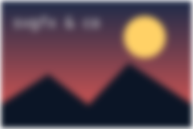 |
| [`bloom`](effects/bloom.ts) |  |  |
| [`glow`](effects/glow.ts) |  | 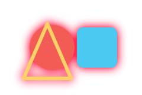 |
| [`shadow`](effects/shadow.ts) |  | 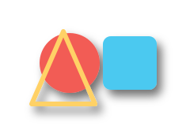 |
| [`grayscale`](effects/grayscale.ts) |  |  |
| [`saturate`](effects/saturate.ts) |  |  |
| [`hue-rotate`](effects/hue-rotate.ts) |  |  |
| [`invert`](effects/invert.ts) |  | 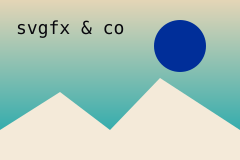 |
| [`brightness`](effects/brightness.ts) |  |  |
| [`contrast`](effects/contrast.ts) |  | 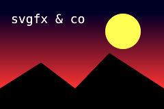 |
| [`sepia`](effects/sepia.ts) |  |  |
| [`fade`](effects/fade.ts) |  | 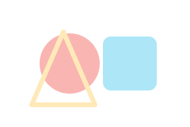 |
| [`posterize`](effects/posterize.ts) |  | 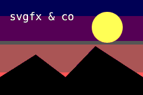 |
| [`threshold`](effects/threshold.ts) |  | 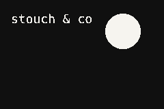 |
| [`duotone`](effects/duotone.ts) |  | 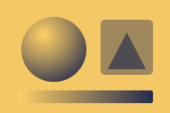 |
| [`tint`](effects/tint.ts) |  |  |
| [`grain`](effects/grain.ts) |  |  |
| [`scanlines`](effects/scanlines.ts) |  | 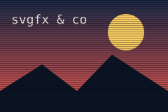 |
| [`chromatic-aberration`](effects/chromatic-aberration.ts) |  | 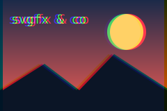 |
| [`glitch`](effects/glitch.ts) |  | 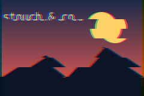 |
| [`pixelate`](effects/pixelate.ts) |  | 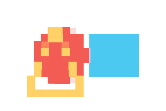 |
| [`halftone`](effects/halftone.ts) |  |  |
| [`vignette`](effects/vignette.ts) |  |  |
| [`outline`](effects/outline.ts) |  | 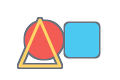 |
| [`wave`](effects/wave.ts) |  | 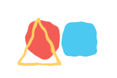 |
| [`emboss`](effects/emboss.ts) |  | 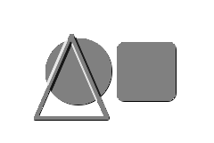 |
| [`sharpen`](effects/sharpen.ts) |  |  |

## Presets

| Example | Before | After |
| ------- | ------ | ----- |
| [`crt`](presets/crt.ts) |  | 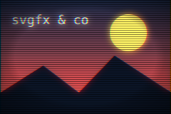 |
| [`cyberpunk`](presets/cyberpunk.ts) |  | 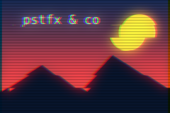 |
| [`film`](presets/film.ts) |  |  |
| [`neon`](presets/neon.ts) |  | 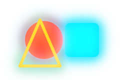 |
| [`newsprint`](presets/newsprint.ts) |  | 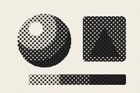 |
| [`riso`](presets/riso.ts) |  | 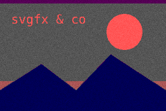 |
| [`vhs`](presets/vhs.ts) |  | 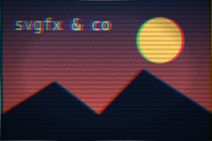 |
| [`xerox`](presets/xerox.ts) |  | 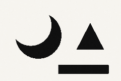 |

## Already animated

`sources/motion.svg` loops on its own — a pulsing circle, a spinning square, a bar
sliding back and forth, a stroke dashing along a path, all in plain SMIL. Effects are
applied to it without disturbing any of that.

| Example | Before | After |
| ------- | ------ | ----- |
| [`motion-crt`](animated/preset-over-motion.ts) |  |  |
| [`motion-layered`](animated/layered-motion.ts) |  | 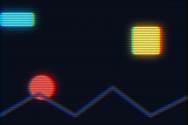 |

Open `svgs/motion-crt.after.svg` or `svgs/motion-layered.after.svg` in a browser: one
file, no JavaScript, everything moving.

## Going further

The examples are deliberately one effect each. In real use they stack, and effects that
take an `animate` option will loop on their own once you turn it on:

```ts
stouch(source, [scanlines({ animate: true, speed: 4 }), grain({ animate: true })])
```

`npm run gallery` renders every effect and preset side by side into
`examples/gallery.html` for a single-page overview, including the animated ones.
